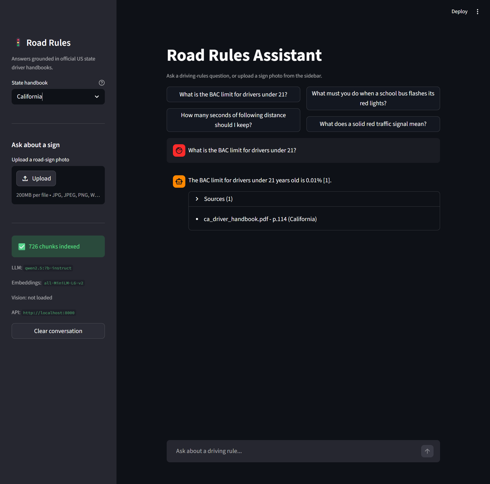
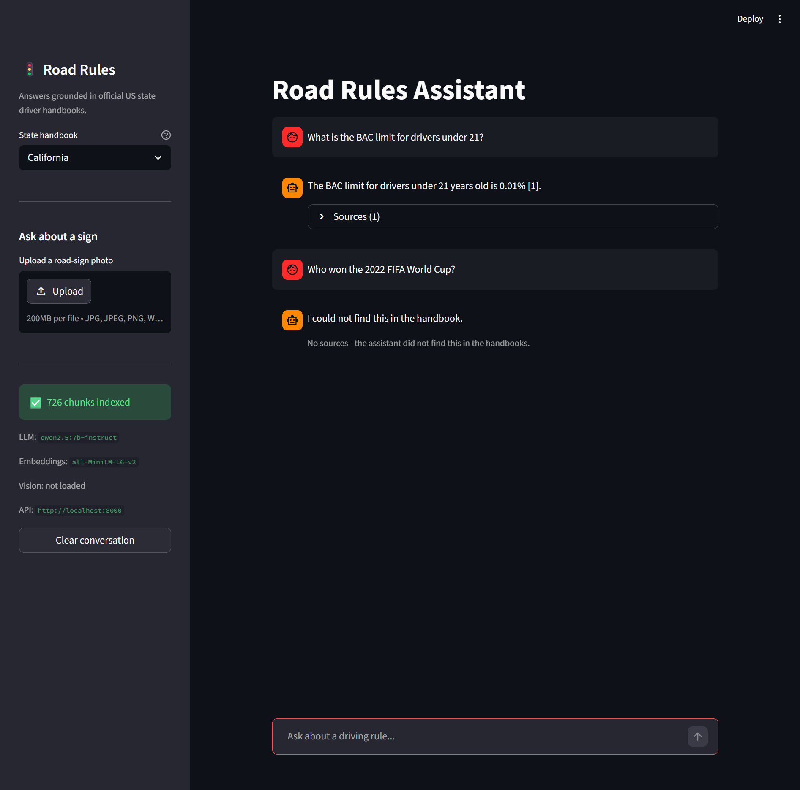
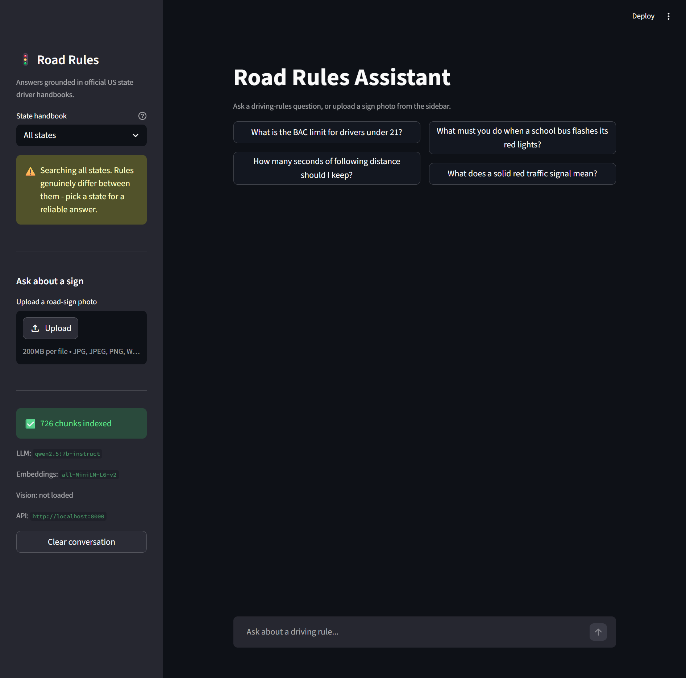

# 🚦 Road Rules RAG Assistant

A retrieval-augmented assistant over three official US state driver handbooks. Ask a driving-rules
question — or upload a photo of a road sign — and get an answer **grounded in the handbook text**,
with a page citation.

Built for the ITI Level 2 Summer Training graduation project (**Extended Track**: RAG + Computer
Vision).

> **Why grounding is the point.** A 7B model does not reliably know California's BAC threshold for
> drivers under 21 or Virginia's following-distance rule. This assistant answers *only* from retrieved
> handbook text, cites the page, and says **"I could not find this in the handbook."** when the corpus
> does not cover the question — verified across 15 test questions in §2.6 of the notebook.

---

## Architecture

```
                    ┌─────────────── BUILD TIME (run once) ───────────────┐
                    │                                                      │
  3 handbook PDFs ──┼─► pypdfium2 extract ─► clean ─► chunk (1000/150)     │
                    │        └─► MiniLM embed (GPU) ─► ChromaDB (persist)  │
                    │                                                      │
  sign image set ───┼─► yolo11n fine-tune (Colab T4) ──► signs_yolo.pt     │
                    └──────────────────────┬───────────────────────────────┘
                                           │ artifacts committed to the repo
                                           ▼
   ┌──────────────┐   HTTP    ┌─────────────────────────────────────────┐
   │  Streamlit   │ ────────► │  FastAPI                                │
   │  app.py      │           │   lifespan loads everything ONCE:       │
   │  · chat      │           │     retrieval.py ──► ChromaDB (on disk)  │
   │  · state sel │           │     vision.py    ──► signs_yolo.pt       │
   │  · image up  │ ◄──────── │     generation.py ─► Ollama qwen2.5:7b   │
   └──────────────┘  answer + └─────────────────────────────────────────┘
                     sources[]
```

Nothing is rebuilt per request: the vector store, embedding model, YOLO weights and Ollama client are
all loaded once in the FastAPI lifespan handler.

---

## Tech stack

| Layer | Choice | Why |
|---|---|---|
| Extraction | `pypdfium2` | Follows reading order on multi-column handbook pages better than `pypdf` |
| Chunking | Recursive character split, 1000 / 150 | A handbook rule is one short titled subsection; see §2.2 |
| Embeddings | `all-MiniLM-L6-v2` (384-d) | Fast, strong on short question→passage matching |
| Vector store | **ChromaDB** (persisted) | Stores chunk text + metadata beside vectors, so citations and the state filter come for free |
| LLM | **`qwen2.5:7b-instruct`** via Ollama | Runs locally; ~6–9 s per answer warm |
| Vision | **`yolo11n`** (Ultralytics) | ~6 MB weights, ~60 ms per image on CPU |
| Backend | FastAPI + Pydantic v2 | |
| Frontend | Streamlit | |

---

## Project structure

```
.
├── notebooks/
│   ├── rag_pipeline.ipynb          # main deliverable — runs top-to-bottom
│   └── yolo_training_colab.ipynb   # YOLO fine-tuning on a free Colab T4
├── data/
│   ├── handbooks/                  # 3 PDFs — committed (10 MB)
│   ├── signs/                      # image dataset — gitignored, see "Data"
│   └── vector_store/               # notebook build output — gitignored (regenerable)
├── backend/
│   ├── app/
│   │   ├── main.py                 # app factory, CORS, lifespan
│   │   ├── api/routes/query.py     # /health, /query, /query/image
│   │   ├── core/config.py          # pydantic-settings
│   │   ├── schemas/query.py        # request/response models
│   │   ├── services/
│   │   │   ├── retrieval.py        # Chroma + query embedding
│   │   │   ├── generation.py       # prompt + Ollama
│   │   │   └── vision.py           # YOLO + class→query mapping
│   │   └── utils/logging_config.py
│   ├── data/vector_store/          # ChromaDB the API serves — committed (9 MB)
│   ├── models/signs_yolo.pt        # YOLO weights (~6 MB)
│   ├── tests/test_query.py
│   ├── requirements.txt  .env.example  Dockerfile
├── frontend/
│   ├── app.py  api_client.py  requirements.txt  .env.example
└── docs/screenshots/
```

---

## Data

### Text corpus — 3 official driver handbooks (committed)

| State | Document | Pages | Source |
|---|---|---|---|
| California | Driver's Handbook (DL 600) | 132 | <https://www.dmv.ca.gov/portal/driver-handbooks/> |
| New York | State Driver's Manual (MV-21) | 84 | <https://dmv.ny.gov/brochure/mv21.pdf> |
| Virginia | Driver's Manual (DMV 39) | 40 | <https://www.dmv.virginia.gov/> |

256 pages, ~605k characters, **726 chunks**. All three are born-digital PDFs — text selects cleanly,
so **no OCR is required**.

> **Attribution.** The California Driver's Handbook is published by the California DMV under
> **CC BY-NC 4.0**. The New York and Virginia manuals are free government publications. They are
> committed here for non-commercial educational use so the project runs straight after a clone.

The built vector store is committed at `backend/data/vector_store/` (9 MB) — the copy the API actually
serves — so a fresh clone runs without rebuilding anything. The notebook's own output directory
(`data/vector_store/`) is gitignored as a regenerable duplicate.

### Image dataset — road signs (not committed)

**Kaggle Road Sign Detection** — 877 images, 4 classes: `stop`, `speedlimit`, `crosswalk`,
`trafficlight`.

- Kaggle (PASCAL VOC XML): <https://www.kaggle.com/datasets/andrewmvd/road-sign-detection>
- **Roboflow mirror in YOLO format** (recommended — no conversion needed):
  <https://universe.roboflow.com/kaggle-road-sign-dataset/kaggle-road-sign-dataset>

Download requires a free Kaggle or Roboflow account, so the images are gitignored. The **trained
weights are committed** (`backend/models/signs_yolo.pt`), so you do not need the dataset to run the
app — only to retrain.

---

## Setup

### Prerequisites

- Python 3.10+ (built on 3.11.9)
- [Ollama](https://ollama.com) running locally
- ~6 GB free disk for the model

```bash
ollama pull qwen2.5:7b-instruct
```

### 1. Backend

```bash
cd backend
python -m venv .venv && .venv\Scripts\activate     # Windows
# source .venv/bin/activate                        # macOS / Linux
pip install -r requirements.txt
cp .env.example .env
uvicorn app.main:app --reload
```

Open <http://localhost:8000/docs> for Swagger UI. The startup log should read:

```
ready: 726 chunks | states=California, New York, Virginia | llm=qwen2.5:7b-instruct (reachable=True) | yolo=True
```

### 2. Frontend

In a second terminal:

```bash
cd frontend
pip install -r requirements.txt
cp .env.example .env
streamlit run app.py
```

Open <http://localhost:8501>.

### 3. Rebuilding the artifacts (optional)

The vector store is committed, so this is only needed if you change the corpus or chunking:

```bash
pip install jupyter chromadb sentence-transformers pypdfium2 ollama pandas matplotlib
jupyter notebook notebooks/rag_pipeline.ipynb     # Kernel → Restart & Run All
```

To retrain the sign detector, open `notebooks/yolo_training_colab.ipynb` in Google Colab
(Runtime → T4 GPU) and save the downloaded `best.pt` to `backend/models/signs_yolo.pt`.

---

## Environment variables

### Backend (`backend/.env`)

| Variable | Default | Description |
|---|---|---|
| `VECTOR_STORE_PATH` | `data/vector_store` | Persisted ChromaDB directory |
| `YOLO_WEIGHTS_PATH` | `models/signs_yolo.pt` | Fine-tuned sign detector |
| `LLM_MODEL` | `qwen2.5:7b-instruct` | Ollama model tag |
| `OLLAMA_HOST` | `http://localhost:11434` | Ollama endpoint |
| `LLM_TEMPERATURE` | `0.0` | Deterministic answers |
| `LLM_NUM_PREDICT` | `400` | Max tokens generated |
| `TOP_K` | `5` | Chunks retrieved per query |
| `DETECTION_CONFIDENCE` | `0.25` | YOLO confidence threshold |
| `CORS_ORIGINS` | `http://localhost:8501,http://127.0.0.1:8501` | Allowed frontend origins |
| `LOG_LEVEL` | `INFO` | |

### Frontend (`frontend/.env`)

| Variable | Default | Description |
|---|---|---|
| `API_BASE_URL` | `http://localhost:8000` | Backend base URL — **never hard-coded in the app** |

---

## API reference

### `GET /health`

```bash
curl http://localhost:8000/health
```

```json
{
  "status": "ok",
  "chunks": 726,
  "embedding_model": "all-MiniLM-L6-v2",
  "llm_model": "qwen2.5:7b-instruct",
  "llm_reachable": true,
  "yolo_loaded": true,
  "states": ["California", "New York", "Virginia"]
}
```

### `POST /query`

```bash
curl -X POST http://localhost:8000/query \
  -H "Content-Type: application/json" \
  -d '{"question": "What is the BAC limit for drivers under 21?", "state": "California"}'
```

```json
{
  "answer": "The BAC limit for drivers under 21 years old is 0.01% [1].",
  "sources": [
    "ca_driver_handbook.pdf - p.114 (California)",
    "ca_driver_handbook.pdf - p.27 (California)"
  ],
  "detections": []
}
```

| Field | Type | Notes |
|---|---|---|
| `question` | `str` | Required, 3–500 chars |
| `state` | `str \| null` | Restricts retrieval to one handbook |
| `top_k` | `int` | 1–20, default 5 |

Returns **422** on a missing or too-short `question`, **503** if Ollama is unreachable.

### `POST /query/image`

```bash
curl -X POST http://localhost:8000/query/image \
  -F "file=@stop_sign.jpg" \
  -F "state=California"
```

Returns the same shape plus `detections`:

```json
{
  "answer": "You must make a full stop at the limit line ... [1]",
  "sources": ["ca_driver_handbook.pdf - p.39 (California)"],
  "detections": [{"label": "stop", "confidence": 0.91, "bbox": [142, 88, 268, 214]}]
}
```

**415** for a non-image upload, **413** above 10 MB, **503** if the weights are not loaded.

---

## Evaluation

15 questions in four groups, scored automatically in §2.6 of the notebook.

| Metric | Result |
|---|---|
| Retrieval hit-rate (gold page in top-5) | **100%** (11 scored) |
| Groundedness (cited a block, or refused) | **100%** |
| Answer correctness (expected value present) | **100%** |
| Out-of-scope refusal rate | **100%** (3/3) |

Sample rows:

| Question | State | Retrieved | Answer | ✓ |
|---|---|---|---|---|
| BAC limit for drivers under 21? | California | CA p.114 | "0.01% [1]" | ✓ |
| Following distance under 35 MPH? | Virginia | VA p.21 | "2 seconds [1]" | ✓ |
| School bus flashing red lights? | New York | NY p.40 | "must stop before reaching the bus [1]" | ✓ |
| Clearance when passing a bicyclist? | California | CA p.90 | "at least 3 feet [1]" | ✓ |
| *Who won the 2022 FIFA World Cup?* | — | — | *"I could not find this in the handbook."* | ✓ |

### Headline failure case: cross-state contamination

Asked *"What is the BAC limit for drivers under 21?"* **without** a state filter, the top two chunks
are both New York p.6 — a passage containing neither "BAC" nor any threshold. The California page that
actually holds the 0.01% / 0.08% table is pushed to rank 3.

| `k` | filter | retrieved | outcome |
|---|---|---|---|
| 2 | off | NY p.6, NY p.6 | **refuses** — the answer never enters the context |
| 2 | on | CA p.114, CA p.27 | correct |
| 3 | off | NY p.6, NY p.6, CA p.114 | correct, citing `[3]` |
| 5 | on | CA p.114 first | correct, citing `[1]` |

So the state filter's real job is not to stop the model answering from the wrong state — it is to stop
the wrong state's pages **consuming the context budget**. At `k=5` the correct page still squeezes in;
at `k=2` it does not. Notably the assistant **refuses rather than inventing a number**, which is itself
evidence the grounding instruction holds.

**Mitigation:** `state` is chunk metadata passed as a Chroma `where` filter, exposed as a sidebar
selector that warns when set to "All states". Other failure cases and their fixes are written up in
§2.6 of the notebook.

---

## Tests

```bash
cd backend
python -m pytest -v
```

The Ollama call is stubbed, so the suite passes on a fresh clone with no LLM running. Retrieval runs
for real against the committed vector store. Covers the happy path, two 422 validation cases, the
out-of-scope refusal, state-filter isolation, and a 415 on a non-image upload.

---

## Docker (backend)

```bash
cd backend
docker build -t road-rules-api .
docker run -p 8000:8000 \
  -e OLLAMA_HOST=http://host.docker.internal:11434 \
  --add-host=host.docker.internal:host-gateway \
  road-rules-api
```

Ollama runs on the **host**, not in the container.

---

## Screenshots

**Grounded answer with its citation expanded** — the California handbook is selected, the answer cites
`[1]`, and the source list resolves to the exact page the fact came from:



**Refusal on an out-of-scope question** — the assistant declines rather than answering from the model's
own knowledge, and shows no sources:



**Landing view** — example questions, the state selector with its "All states" warning, and the
sign-upload panel:



---

## Licence & attribution

Code released for educational use. The California Driver's Handbook is © California DMV, reused under
**CC BY-NC 4.0**. The New York and Virginia manuals are free government publications. The road-sign
dataset is redistributed by its original authors on Kaggle and Roboflow under their respective terms.
